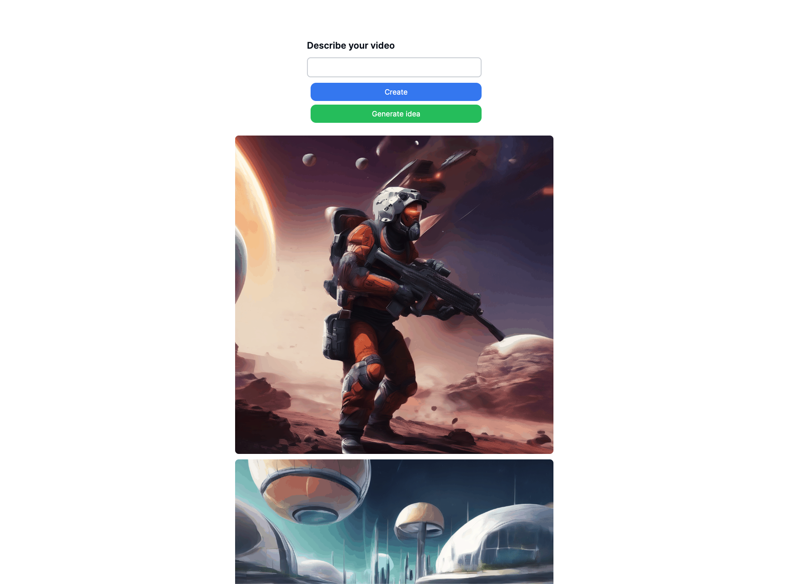

# Fleek Functions

Click [here](https://play.fleek.network/) to get started building.

To learn more visit [https://blog.fleek.network/post/fleek-network-phase-3-release/](https://blog.fleek.network/post/fleek-network-phase-3-release/)

To build this app, create a file named `.env.local` with an API key from [Fal.ai](https://www.fal.ai/dashboard)

```
FAL_KEY="your-api-key"
```



## Example code for function

```typescript
const main = (params) => {
  return getPrompt()
}

function getPrompt() {
    return imagePrompts[Math.floor(Math.random() * imagePrompts.length)]
}

const imagePrompts = [
  // 1000 prompts
]
```